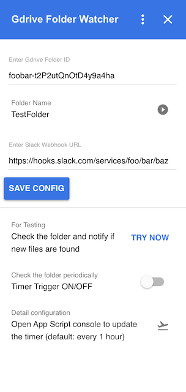

# Google Drive Folder Watcher Add-On
Google Drive Add-On Folder Watcher Google Apps Script to get notifications by Slack Webhook



## Setup Add-On Manually

* First, create new standalone app from https://script.google.com/
* copy and paste both `Code.js` and `appsscript.json`
* you might want to change `logoUrl` in `appsscript.json`
  - the default icon url is from the official sample code
* In the Apps Script editor, Click Deploy > Test deployments > Install
  - cf. official document
  - https://developers.google.com/workspace/add-ons/how-tos/testing-gsuite-addons
* open https://drive.google.com/drive/my-drive
  - you should see the Add-On icon at right side of the page

## Setup Folder Watcher Timer Trigger

* fill in the Folder ID and Slack Webhook URL and save the config
  - note Slack Webhook URL here is the traditional one without token
* push "TRY NOW" to test and see if it works fine
* turn on the trigger if all looks good
* you can update the timer to less than 1 hour
  - once per hour is system default quota programmatically
  - but you can overwrite it manually (say every one minute)
  - https://developers.google.com/apps-script/guides/triggers/installable#time-driven_triggers

## Setup Google Apps Script Dev Tools

```bash
node --version
v14.15.5

npm --version
7.9.0

# https://github.com/google/clasp
npm init -y
npm install --save-dev @google/clasp

npx clasp --version
2.3.0

clasp login
clasp login --status
```

## Setup Add-On by using CLI

* Now using Apps Script editor in JavaScript is recommended
  - Apps Script editor is significantly improved recently
  - and when you use TypeScript, you cannot use Apps Script editor
  - So now you don't need local development in TypeScript
* CLI `clasp` is useful to pull the code and push to GitHub for version control
* You should be able to use the following commands.
  - cf. official document https://github.com/google/clasp

```bash
# when you want to start new project from CLI
clasp create --type standalone --title "Title" --rootDir ./src
# when you start new project from https://script.google.com/
# https://developers.google.com/apps-script/guides/standalone
clasp clone --rootDir /src

# you should have proper .clasp.json by create or clone

clasp open

# update local files from remote
clasp pull
# update remote if you changed the code locally
clasp push
```
